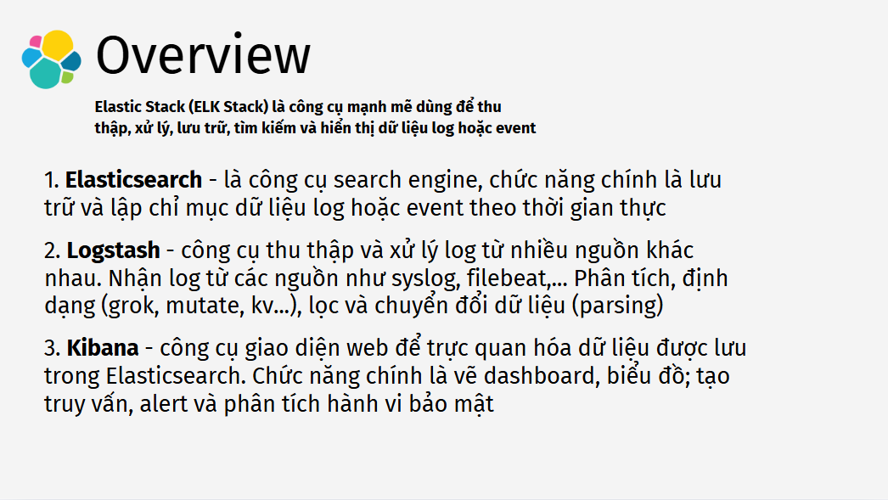
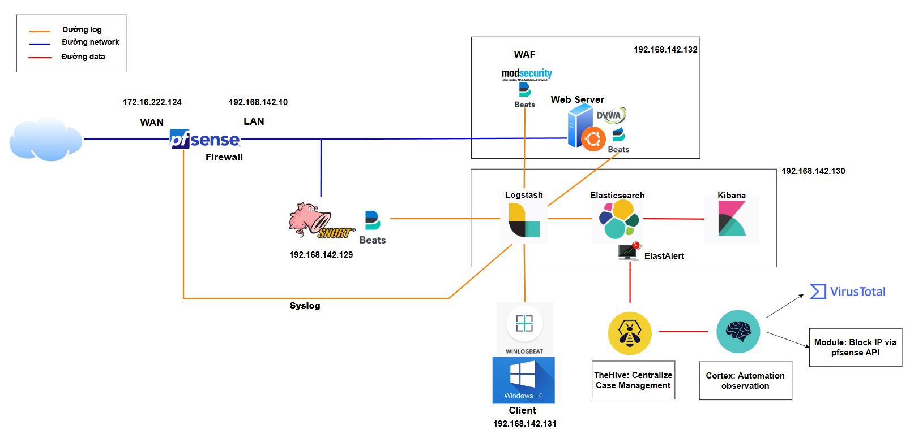
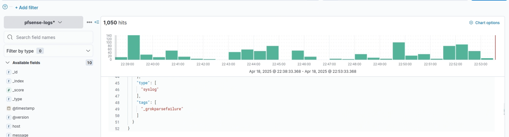
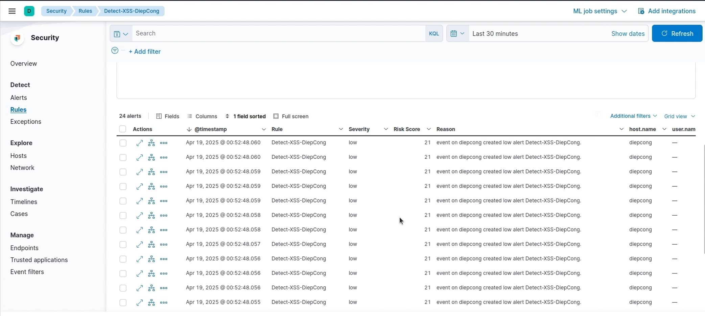

# ELK-Based SIEM Monitoring System
## Mục tiêu
Xây dựng hệ thống SIEM để dễ dàng quản lý log trong một hệ thống mạng nội bộ gồm các thiết bị an toàn mạng, web server và client. Mục tiêu chính là thu thập, xử lý, phân tích và giám sát nhật ký từ tường lửa pfSense, hệ thống IDS Snort, web server có ModSecurity WAF và máy Windows, nhằm phát hiện kịp thời các sự kiện bảo mật và trực quan hóa thông tin trong thời gian thực.

## Tổng quan về ELK Stack

**1. Elasticsearch:**
  - Công cụ tìm kiếm và phân tích: Lưu trữ dữ liệu dưới dạng JSON trong các index, cho phép truy vấn full-text, hỗ trợ phân tích số liệu

**2. Logstash:**
  - Trạm trung chuyển dữ liệu: Nhận dữ liệu từ nhiều nguồn (file log, syslog, FileBeat, database...), xử lý và chuyển tiếp dữ liệu.
  - Pipeline: Gồm 3 giai đoạn - input (nhận dữ liệu đầu vào), filter (parse, gắn thẻ...) và output (đẩy dữ liệu tới Elasticsearch hoặc nơi khác)

**3. Kibana:**
  - Giao diện trực quan: Cho phép xây dựng dashboard, biểu đồ (line, bar, pie, maps...) và report dựa trên dữ liệu trong Elasticsearch
  - Khám phá dữ liệu: Tìm kiếm, lọc và phân tích log/event theo thời gian thực
  - Quản lý và mở rộng: tạo index patterns, visualization, cài đặt alerting...

## Phạm vi (các modules triển khai)
- Log Collection: File cấu hình và script đẩy log từ từng thiết bị và endpoint vào Logstash
- Log Ingestion & Parsing: Pipeline Logstash để chuẩn hóa, enrich sự kiện trước khi lưu vào Elasticsearch.
- Searching & Investigation: Truy vấn KQL và thiết lập index mapping hỗ trợ truy vấn, săn tìm mối đe dọa
- Detection & Alerting: Bộ quy tắc Snort và cấu hình ELK Security để phát hiện SQLi, XSS, DDoS...
- Visualization & Reporting: Trực quan hóa bằng dashboard
- Documentations: Sơ đồ kiến trúc, hướng dẫn triển khai từng thành phần và báo cáo tổng kết kết quả, bài học kinh nghiệm, định hướng phát triển

## Tech stack & Kiến trúc tổng quan

**Tech stack**

Chi tiết kiến trúc hệ thống tại [Sơ đồ kiến trúc và mô tả chi tiết](docs/architecture.md).

## Deployment

Hướng dẫn triển khai hệ thống xem chi tiết tại [Deployment Guide](docs/deployment-guide.md)

## Demo Videos

Xem các video minh họa hoạt động của hệ thống: [Video Demo](https://drive.google.com/drive/folders/11oPinABcN_RSF0s3mgBEs7_I8LKQiLiN?usp=sharing)

| Feature    | Demo                                                         |
|--------------|--------------------------------------------------------------|
| Log Collection     | Demo1+2_logcollection_&_logparsing.mp4 |
| Log Ingestion & Parsing    | Demo1+2_logcollection_&_logparsing.mp4       |
| Searching & Investigation  | Demo3_searchmodeule.mp4             |
| Detection & Alerting | Demo4_detection&alert.mp4   |
| Visualization & Dashboard | Demo5_Visualization&Dashboard.mp4   |

## Kết quả đạt được

- **Log Ingestion Throughput**
  - Trung bình 200-250 sự kiện/phút được đẩy vào Logstash và lưu trong Elasticsearch mà không bị mất gói. Trong đó, pfsense log chiếm phần lớn log với 50-100 sự kiện/phút, số lượng log còn lại phân bổ lần lượt ở snort, waf và client.

- **Alert Latency**  
  - Trung bình < 2 giây từ khi log vào Elasticsearch đến khi alert được kích hoạt và hiển thị trên Kibana.

 
- **Detection Coverage**  
  - Phát hiện thành công cuộc tấn công mô phỏng, dựa vào core rule set của waf trong đó có:
    - Tấn công SQL Injection
    - Tấn công Cross-Site Scripting (XSS)

   
## Hướng phát triển trong tương lai

- **Cấu hình thêm nhiều dạng detection khác và kiểm thử một cách toàn diện hơn.**
- **Tích hợp khả năng phản hồi khi có xuất hiện alert.**
- **Tích hợp Threat Intelligent**
- **Tích hợp Machine Learning**

