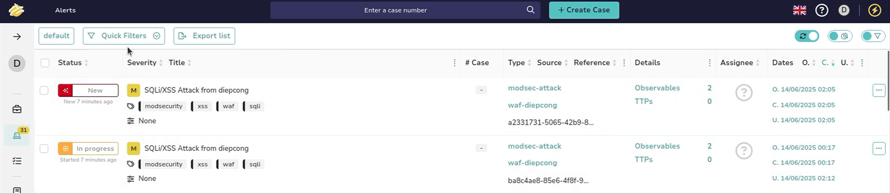
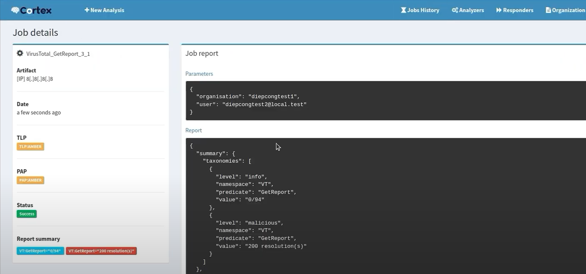
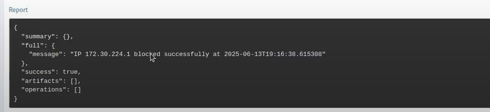
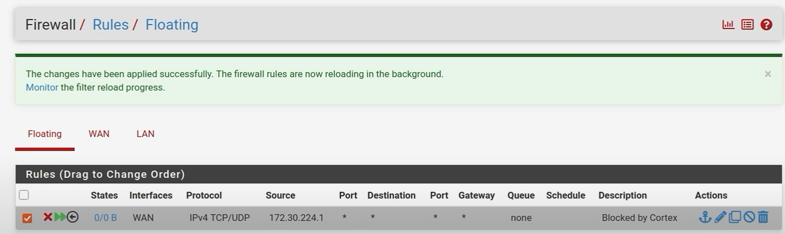

# 🚨 ELK-Based SIEM Monitoring, Detection and Response System

---

## ❗ Pain Points và Động lực phát triển hệ thống
### Pain Points:
- **Cảnh báo sai (false positive)** xảy ra nhiều khi chỉ dựa vào rule-based detection.
- **Thiếu khả năng phản hồi tự động** khiến việc xử lý sự kiện mất thời gian, dễ bỏ sót.
- **Khó mở rộng** và cấu hình thu thập log từ nhiều nguồn nếu không có cấu trúc pipeline rõ ràng.

---

## 🎯 Mục tiêu
Xây dựng hệ thống SIEM để dễ dàng quản lý log trong một hệ thống mạng nội bộ gồm các thiết bị an toàn mạng, web server và client. Mục tiêu chính là thu thập, xử lý, phân tích và giám sát nhật ký từ tường lửa pfSense, hệ thống IDS Snort, web server có ModSecurity WAF và máy Windows, nhằm phát hiện kịp thời các sự kiện bảo mật và trực quan hóa thông tin trong thời gian thực.

➡️ Mở rộng: phản hồi sự kiện thông qua tích hợp SOAR (TheHive + Cortex)

---

## 📋 Yêu cầu hệ thống

### Business Requirements
1. **Real-time Threat Detection**: dùng correlation rules, anomaly detection.
2. **Unified Log Visibility**: triển khai syslog, filebeat, winlogbeat từ các nguồn log khác nhau
3. **Flexible Log Parsing**: sử dụng Grok filter tùy biến trong Logstash.
4. **Incident Response Enablement**: tích hợp với SOAR (TheHive + Cortex).
5. **Security Reporting**: dashboard dành cho điều tra viên và ban quản lý.

### Non-Business Requirements
1. **Performance**: hệ thống phải xử lý log theo thời gian thực.
2. **Network Security**: sử dụng pfSense phân tách mạng nội bộ SIEM.
3. **Application Security**: kiểm soát truy cập dựa trên vai trò trong TheHive/Cortex.

---

## 📚 Tổng quan về ELK Stack

**1. Elasticsearch:**
  - Công cụ tìm kiếm và phân tích: Lưu trữ dữ liệu dưới dạng JSON trong các index, cho phép truy vấn full-text, hỗ trợ phân tích số liệu

**2. Logstash:**
  - Trạm trung chuyển dữ liệu: Nhận dữ liệu từ nhiều nguồn (file log, syslog, FileBeat, database...), xử lý và chuyển tiếp dữ liệu.
  - Pipeline: Gồm 3 giai đoạn - input (nhận dữ liệu đầu vào), filter (parse, gắn thẻ...) và output (đẩy dữ liệu tới Elasticsearch hoặc nơi khác)

**3. Kibana:**
  - Giao diện trực quan: Cho phép xây dựng dashboard, biểu đồ (line, bar, pie, maps...) và report dựa trên dữ liệu trong Elasticsearch
  - Khám phá dữ liệu: Tìm kiếm, lọc và phân tích log/event theo thời gian thực
  - Quản lý và mở rộng: tạo index patterns, visualization, cài đặt alerting...

---

## 🧩 Phạm vi (các modules triển khai)
- Log Collection: File cấu hình và script đẩy log từ từng thiết bị và endpoint vào Logstash
- Log Ingestion & Parsing: Pipeline Logstash để chuẩn hóa, enrich sự kiện trước khi lưu vào Elasticsearch.
- Searching & Investigation: Truy vấn KQL và thiết lập index mapping hỗ trợ truy vấn, săn tìm mối đe dọa
- Detection & Alerting: Bộ quy tắc Snort và cấu hình ELK Security để phát hiện SQLi, XSS, DDoS...
- Visualization & Reporting: Trực quan hóa bằng dashboard.
- Response & SOAR Integration: Tích hợp TheHive và Cortex để tự động tạo case và chặn IP dựa trên kết quả phân tích.
- Documentations: Sơ đồ kiến trúc, hướng dẫn triển khai từng thành phần và báo cáo tổng kết kết quả, bài học kinh nghiệm, định hướng phát triển

---

## 🏗️ Tech stack & Kiến trúc tổng quan

### **Tech stack**
- Elastic Stack (Elasticsearch, Logstash, Kibana)
- Beats (Filebeat, Winlogbeat)
- Snort IDS
- ModSecurity WAF (OWASP CRS)
- pfSense Firewall (Syslog + REST API)
- ElastAlert 2
- TheHive 5 + Cortex (SOAR system)

📌 **Xem chi tiết kiến trúc hệ thống** tại [Sơ đồ kiến trúc và mô tả chi tiết](docs/architecture.md).

---

## 🚀 Deployment

📦 Hướng dẫn triển khai hệ thống xem chi tiết tại [Deployment Guide](docs/deployment-guide.md)

---

## 🎥 Demo Videos

| 💡 Feature    | 🔗 Demo                                                         |
|--------------|--------------------------------------------------------------|
| Log Collection     | [Demo1+2](https://youtu.be/8kT6JZoJT3c) |
| Log Ingestion & Parsing    | [Demo1+2](https://youtu.be/8kT6JZoJT3c)      |
| Searching & Investigation  | [Demo3](https://youtu.be/zlhBIX8wMSs)            |
| Detection & Alerting | [Demo4](https://youtu.be/Nf-PxvZqffA)   |
| Visualization & Dashboard | [Demo5](https://youtu.be/veM75JVKq1Q)   |
| SOAR | [Demo SOAR](https://youtu.be/CYYGcL4dJtw)   |

---

## 📈 Kết quả đạt được

- **Log Ingestion Throughput**
  - Trung bình 200-250 sự kiện/phút được đẩy vào Logstash và lưu trong Elasticsearch mà không bị mất gói. Trong đó, pfsense log chiếm phần lớn log với 50-100 sự kiện/phút, số lượng log còn lại phân bổ lần lượt ở snort, waf và client.

- **Alert Latency**  
  - Trung bình < 2 giây từ khi log vào Elasticsearch đến khi alert được kích hoạt và hiển thị trên Kibana.

 
- **Detection Coverage**  
  - Phát hiện thành công cuộc tấn công mô phỏng, dựa vào core rule set của waf trong đó có:
    - Tấn công SQL Injection
    - Tấn công Cross-Site Scripting (XSS)

- **SOAR Response Flow**
  - Khi attacker thực hiện SQLi vào web server, log của ModSecurity chứa pattern sẽ được phát hiện bởi ElastAlert.
  - ElastAlert gửi cảnh báo đến TheHive, nơi tạo case và lưu lại thông tin IP attacker.
  
  - Cortex được kích hoạt để phân tích IP qua VirusTotal.
  
  
  - Nếu kết quả cho thấy IP nguy hiểm, Cortex sẽ gọi responder để block IP attacker bằng REST API trên pfSense.
    - Tạo Custom Responder: [BlockIPOnPfsenseViaAPI](Cortex-Analyzers/responders/BlockIPOnPfsenseViaAPI).
  
  

---

## 🔮 Technology Trends
Các xu hướng công nghệ hiện nay trong triển khai SIEM hiện đại gồm:
- **SOAR (Security Orchestration Automation and Response)**: Tự động hóa phản ứng sự cố qua playbook.
- **Tích hợp Threat Intelligence**: Phân tích hành vi và độ nguy hiểm dựa trên thông tin bên ngoài.
- **Hệ thống SIEM Cloud-native**: Mở rộng linh hoạt, xử lý hàng triệu log/s.
- **Sử dụng AI/ML và UEBA**: Phát hiện hành vi bất thường thay vì chỉ dựa vào rule.
- Kiến trúc mở, modular và có thể tự động triển khai log agent.

---

## 🚧 Hướng phát triển trong tương lai

- **Cấu hình thêm nhiều dạng detection khác và kiểm thử một cách toàn diện hơn.**
- **Tăng cường khả năng phản hồi khi có xuất hiện alert.**
- **Tích hợp Threat Intelligent**
- **Tích hợp Machine Learning cho phát hiện hành vi bất thường**

---

## 📑 Tài liệu trình bày (Presentation Slides)

| 🧾 Phiên bản | 📄 Nội dung | 🔗 Link tải/view |
|----------|----------|---------------|
| Slide bản gốc | Slide trình bày ý tưởng hệ thống ELK SIEM ban đầu | [📄 slide.pdf](docs/slide.pdf) |
| Slide bản 2.0 | Slide cập nhật với kiến trúc SOAR và minh họa các demo đã triển khai | [📄 slide-v2.0.pdf](docs/slide-v2.0.pdf) |
