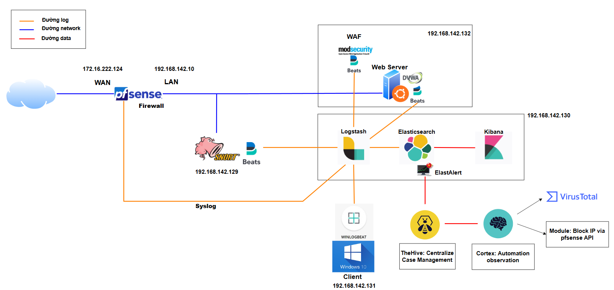

# Infractructure Architecture

**1. Thành phần chính**:
- **Mạng và thiết bị đầu cuối:**
  - pfSense Firewall: Thu thập log firewall, NAT, hỗ trợ triển khai phòng chống tấn công dạng DDoS
  - Host IDS (Snort): Giám sát lưu lượng nội bộ, phát hiện xâm nhập và các loại tấn công dựa trên mạng (network-based attacks)
  - Web Server (DVWA) có WAF (ModSecurity): Mô phỏng một hệ thống có lỗ hổng bằng DVWA, xây dựng WAF để bảo vệ ứng dụng web và gửi log audit
  - Windows Client: Endpoint, phát sinh system event log và application log
- **[ELK Stack](../README.md):**
  - Logstash
  - Elasticsearch
  - Kibana
- **TheHive & Cortex (SOAR):**
  - TheHive: tiếp nhận alert từ ElastAlert, tổ chức điều tra qua các case.
  - Cortex: thực thi các hành động phân tích (analyzer như VirusTotal) và phản hồi (responder như chặn IP qua pfSense REST API).

**2. Sơ đồ Luồng Dữ liệu**
- Thu thập log từ pfSense, Snort, ModSecurity, Windows Client. Trong đó pfSense gửi bằng syslog, Snort và ModSecurity gửi log thông qua FileBeat, Windows Client gửi log thông qua WinLogBeat
- Logstash Pipeline:
  - Input: syslog, filebeat, winlogbeat.
  - Filter: grok, date, geoip, thêm tag và trường metadata.
  - Output: đẩy sự kiện đã parse đến Elasticsearch.
- Elasticsearch:
  - Index data theo định dạng JSON
  - Tạo index pattern (log-*, snort-*, modsec-* với * là trường datetime)
- Kibana:
  - Discover: Tìm kiếm và khảo sát log raw
  - Dashboards: Hiển thị lưu lượng, cảnh báo
  - Alerts: Thiết lập rule trigger qua Elastic Security
- ElastAlert:
  - Theo dõi log trong Elasticsearch, phát hiện pattern đáng ngờ và gửi alert đến TheHive qua rule (API/POST/Webhook/...).
- TheHive:
  - Tạo case điều tra, lưu các artifact như IP/Hash/Domain từ alert.
  - Cho phép phân tích và gán mức độ nguy hiểm.
- Cortex:
  - Khi được kích hoạt từ TheHive, Cortex thực hiện analyzer (VD: kiểm tra IP qua VirusTotal)
  - Nếu kết quả xác định IP độc hại, Cortex có thể gọi responder như chặn IP trên pfSense qua REST API

**3. Chi tiết mỗi thành phần:**

**3.1 pfSense Firewall**
  - Được đặt tại rìa mạng, tiếp nhận lưu lượng từ Internet và mạng nội bộ và giữ vai trò NAT.
  - Cấu hình syslog forward đến Logstash

**3.2 Snort Host IDS**
  - Cài đặt agent trên Linux Ubuntu
  - Sử dụng file output JSON, custom bằng FileBeat, gửi vào Logstash (có thể gửi trực tiếp output vào Logstash vì ELK hỗ trợ định dạng của Snort)
  - Rule set tùy chỉnh phát hiện DDoS, XSS, SQLi (sử dụng bộ Rule Set có sẵn)
    
**3.3 ModSecurity WAF**
  - Cấu hình audit log để capture HTTP request/response
  - Forward file audit_log qua Filebeat vào Logstash
  - Sử dụng bộ rule Core Rule Set ([OWASP CRS](https://github.com/coreruleset/coreruleset))
    
**3.4 Windows Client**
  - Đóng vai trò endpoint, thực hiện các hành vi mạng tương tự người dùng cuối. 
  - Sử dụng Winlogbeat để gửi Windows Event Log
    
**3.5 Logstash:** logstash.conf

**3.6 Elasticsearch & Kibana**
  - Tạo Index Pattern: `pfsense-*`, `snort-*`, `modsec-*`, `winlog-*`
  - Xây dựng dashboard

**3.7 TheHive & Cortex (SOAR)**
  - ElastAlert gửi cảnh báo từ log tấn công (ví dụ SQLi, XSS từ ModSecurity) đến TheHive.
  - TheHive nhận alert và tạo case điều tra, sinh observable như IP nguồn.
  - Cortex thực thi analyzer như VirusTotal để kiểm tra độ nguy hiểm của IP.
  - Nếu IP được đánh giá độc hại, Cortex gọi responder thực hiện block IP thông qua REST API pfSense.
  - Luồng phản hồi khép kín từ phát hiện → điều tra → phản ứng giúp giảm thời gian xử lý và nâng cao tính tự động hóa trong hệ thống SIEM.
   

  
